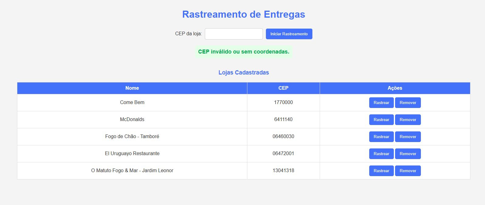

# 🛵 Rastreamento de Entregas

Este projeto é um sistema de rastreamento de entregas com base no CEP da loja. Ele permite visualizar restaurantes cadastrados e rastrear a distância em tempo real entre a localização atual do entregador e o endereço de destino (CEP do restaurante), utilizando geolocalização e a [BrasilAPI](https://brasilapi.com.br).

## 🚀 Funcionalidades

- Visualização de restaurantes cadastrados (nome e CEP).
- Rastreamento em tempo real da distância até um CEP de destino.
- Cálculo da distância com base nas coordenadas geográficas (fórmula de Haversine).
- Cadastro e remoção de restaurantes pelo backend.
- Integração com o banco de dados MySQL.

## 🖼️ Demonstração

Imagem da tela principal do sistema:



---

## ⚙️ Como rodar o projeto

1. **Clonar o repositório**
   ```bash
   git clone https://github.com/joaoespeleta/microservico_geolocalizacao
   cd microservico_geolocalizacao
   ```

2. **Instalar as dependências**
   ```bash
   npm install
   ```

3. **Configurar o `.env` com os dados do seu MySQL**
   ```env
   DB_HOST=localhost
   DB_PORT=3306
   DB_USER=root
   DB_PASSWORD=sua_senha
   DB_NAME=nome_do_banco
   PORT=3000
   ```

4. **Rodar o servidor**
   ```bash
   node server.js
   ```

---

## 📦 Estrutura

```
📂 public/
  ├── script.js
  ├── index.html

 📂 img/
  ├── servico.png

 ├️ 📄 .env
 ├️ 📄 server.js
 ├️ 📄 db.js
```

---

## 📬 Exemplos de Requisições

### 🔍 Listar Restaurantes

**GET** `/api/restaurantes`

**Resposta:**
```json
[
  {
    "id": 1,
    "nome": "Restaurante A",
    "cep": "17700000"
  },
  {
    "id": 2,
    "nome": "Restaurante B",
    "cep": "06414070"
  }
]
```

---

### ➕ Adicionar Restaurante

**POST** `/api/restaurantes`

**Body:**
```json
{
  "nome": "Novo Restaurante",
  "cep": "01001000"
}
```

**Resposta:**
```json
{
  "success": true
}
```

---

### ❌ Remover Restaurante

**DELETE** `/api/restaurantes/:id`

**Exemplo:**
```
DELETE /api/restaurantes/4
```

**Resposta:**
```json
{
  "success": true
}
```

---

## 📌 Observações

- A funcionalidade de rastreamento depende da permissão de geolocalização do navegador.
- A criação de restaurantes também pode ser feita por uma página externa dedicada - microsserviço 1.

---

## 🧑‍💻 Tecnologias Utilizadas

- Node.js + Express
- MySQL
- HTML, CSS e JavaScript
- [BrasilAPI](https://brasilapi.com.br)
- Geolocalização via navegador

---

## Direitos Autorais

Este projeto foi desenvolvido por **João Espeleta** com fins educacionais e de demonstração.

Todos os direitos reservados © João Espeleta.  
Você pode utilizar este código livremente para fins pessoais e educacionais.  
Para uso comercial, entre em contato com o autor.
